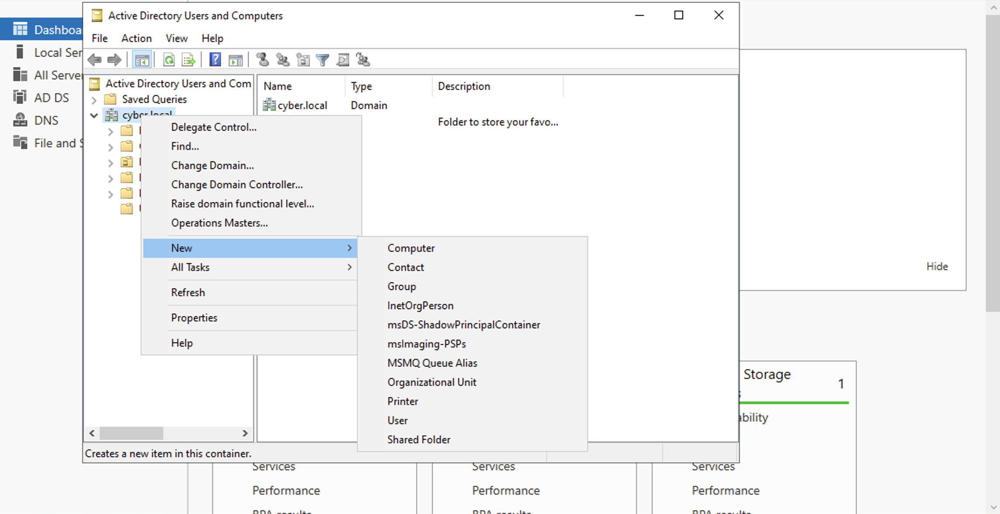
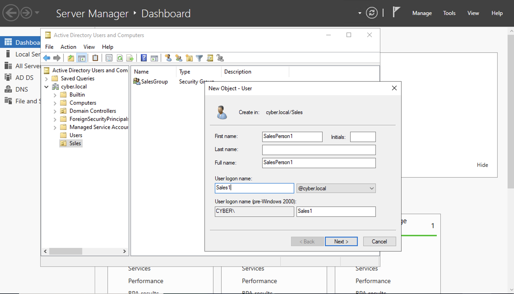
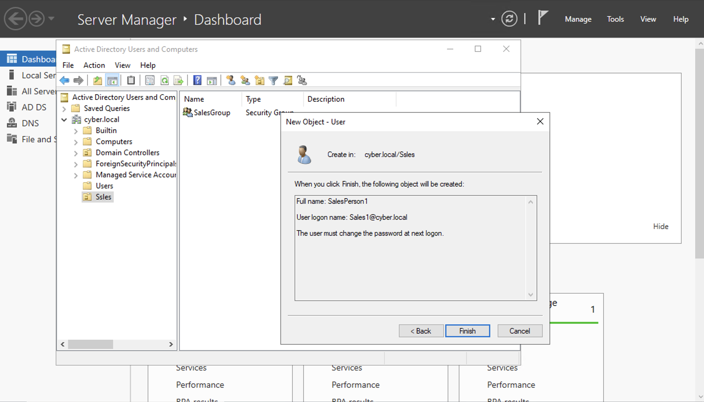

# Adding OUs Users and Groups 🧑‍🧑‍🧒
-This lab illustrates how to create an **OU**, a **Group**, a **User** and how to link that user to a group
### Step 1: Adding Organizational Units
- To add a new **Organizational Unit**, click on **Tools** on the top right of the **Server Manager** -> Click on **Active Directory Users and Groups** -> **Right Click** on the **cyber.local** domain -> **New** -> **Organizational Unit**, and name it what you please.

### Step 2: Adding Users and Groups
- In the newly created **OU** right click in the empty space -> Click **New** -> **Group** and name it as you please
- To create a new **User** in the **Sales** **OU**, right click in the empty space again -> **New** -> **User** (name it how you see fit) -> Click **Next** -> Create a generic **Password** for the User(leave the option on for the user needing to create a new password)
- Review the configurations for the newly created **User** and select **Finish**

## Demo Videos🎥
-[OU Demo](https://www.loom.com/share/45d9b499dfbb46e9a7f5ce8e8efc8e31?sid=e33c9676-5cc2-47ba-82da-0197373c2d8c)

-[Group Demo](https://www.loom.com/share/4c00e254803a4588b8bb695b29ff0f65?sid=ca71686e-be34-4f4e-9582-7782eebbcbaa)

-[Creating a User Demo](https://www.loom.com/share/70a02ece3fd4490781bf9eed19b3081f?sid=0316254e-80f2-48fe-bf97-84cf62d63648)
